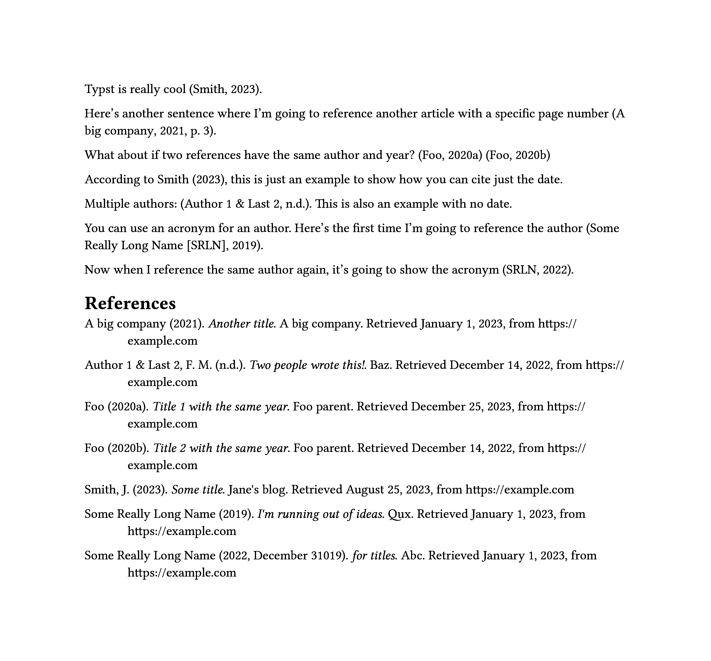

# apa-bibliography

## :warning: Deprecated

[Typst v0.9.0](https://github.com/typst/typst/releases/tag/v0.9.0) has a new bibliography engine that now handles APA bibliographies correctly.

---

Typst’s default [`#bibliography(style: "apa")`][bib] has
[numerous issues][issue] with its output not conforming to APA 7th guidelines.
This package aims to provide a replacement that is somewhat compatible with the
builtin function.

## Installation

Follow the Typst instructions on installing [local packages][typst-local-pkgs].
At this stage I will not be publishing this package on the official Typst
repository — hopefully the builtin bibliography will be improved and this
package will only be temporary.

## Usage



```typst
#import "@local/apa-bibliography:0.0.1": apa-bibliography

#let (reference: r, reference-with-page: rp, reference-date-only: rd, bibliography) = apa-bibliography(yaml("works.yml"))

Typst is really cool #r.typst-is-cool.

Here's another sentence where I'm going to reference another article with a specific page number #(rp.company-report)[p. 3].

What about if two references have the same author and year? #r.same-year1 #r.same-year2

According to Smith #rd.typst-is-cool, this is just an example to show how you can cite just the date.

Multiple authors: #r.multiple-authors. This is also an example with no date.

You can use an acronym for an author. Here's the first time I'm going to reference the author #r.long-author1.

Now when I reference the same author again, it's going to show the acronym #r.long-author2.

= References

#bibliography
```

`works.yml`:

```yml
typst-is-cool:
  author:
    name: Smith
    given-name: Jane
  title: Some title
  date: 2023
  url:
    value: https://example.com
    date: 2023-08-25
  parent:
    title: Jane's blog
company-report:
  author: A big company
  title: Another title
  date: 2021
  url:
    value: https://example.com
    date: 2023-01-01
  parent:
    title: A big company
same-year1:
  author: Foo
  title: Title 1 with the same year
  date: 2020
  url:
    value: https://example.com
    date: 2023-12-25
  parent:
    title: Foo parent
same-year2:
  author: Foo
  title: Title 2 with the same year
  date: 2020
  url:
    value: https://example.com
    date: 2022-12-14
  parent:
    title: Foo parent
multiple-authors:
  author:
  - Author 1
  - given-name: First 2
    middle-name: Middle 2
    name: Last 2
  title: Two people wrote this!
  url:
    value: https://example.com
    date: 2022-12-14
  parent:
    title: Baz
long-author1:
  author:
    name: Some Really Long Name
    short-name: SRLN
  title: I'm running out of ideas
  date: 2019
  url:
    value: https://example.com
    date: 2023-01-01
  parent:
    title: Qux
long-author2:
  author:
    name: Some Really Long Name
    short-name: SRLN
  title: for titles
  date: 2022-12-31019
  url:
    value: https://example.com
    date: 2023-01-01
  parent:
    title: Abc
```

Like the builtin `bibliography`, this package supports the [Hayagriva][hayagriva]
file format. Unlike the builtin function, this package does *not* support
BibTeX.

Some other notable differences:

- You must pass the parsed YAML data to the function rather than the path to the file
- The bibliography lists *everything* in the file, including ones that you haven’t referenced to in the document
- The bibliography does not include a heading. Add it separately
- The casing of titles is kept as-is, like if `verbatim: true` was set
- This package completely ignores the `type` field (for now)
- This package is incomplete and if there’s something you need, please open an issue (or PR if you want to implement it)! I created this for my personal use so I only implemented what I needed.
  - There are a few extra features, some of which are showcased in the above example. Documentation is incomplete but if you’re curious you can have a look at the [source](./lib.typ).

[bib]: https://typst.app/docs/reference/meta/bibliography/
[issue]: https://github.com/typst/typst/issues/1161
[typst-local-pkgs]: https://github.com/typst/packages#local-packages
[hayagriva]: https://github.com/typst/hayagriva/blob/main/docs/file-format.md
